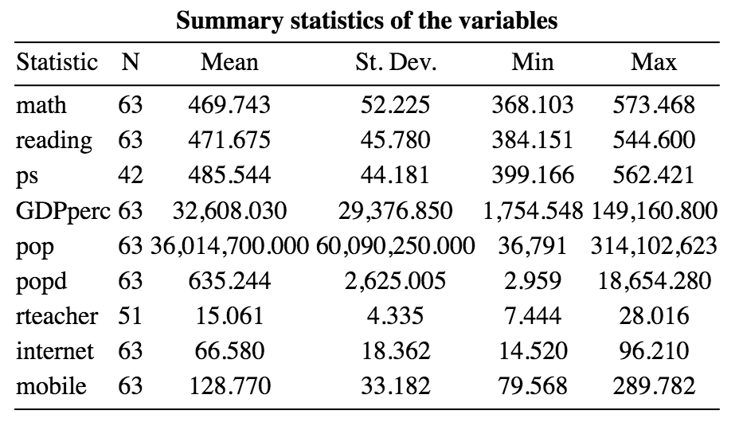
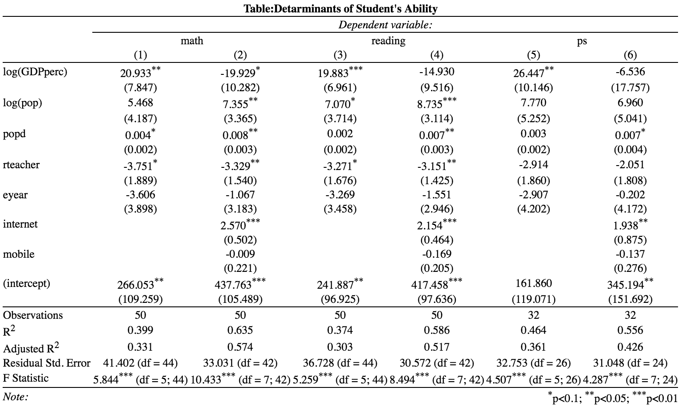
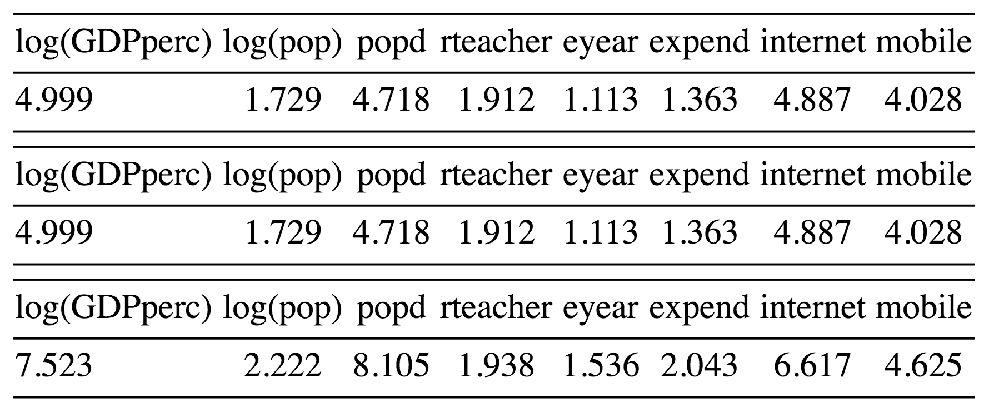

```{r setup, include=FALSE}
knitr::opts_chunk$set(echo = TRUE)
library(stargazer)
library(magrittr)  
library(ggplot2)
library(interplot)  
library(dplyr)  
library(devtools)
library(xlsx)
library(knitr)
library(DAAG)
library(jpeg)
```

```{r , echo=FALSE, comment=NA, warning=FALSE, error=FALSE, message=FALSE, results='asis'}
##Data install
data <- read.xlsx("/Users/komaiyumi/Desktop/Social Sicence/web/Data/PISA_Data.xlsx",1)

##Data Cleaning
cdata <- subset(data, select = c(1,3,4,5,6,7,9,10,12,14,16,17))
cdata <- cdata[,c(1,3,2,4,7,8,9,10,11,12,5,6)]

#For Growth comparison
##Data install
pisa <- read.xlsx("/Users/komaiyumi/Desktop/Social Sicence/web/Data/PISA_Data.xlsx",2)
pisa <- pisa[1:41,]
```

##Outline
1. Introduction
2. Research Question and Hypothesis
3. Data Sources
4. Methodology
5. Result & Analysis
6. Findings & Limitations

##Introduction


##Research Question and Hypothesis
###Reserch Question
- The aim of our research is to analyse if there is a significant impact on students ability made by the Internet accecibility.

<<<<<<< HEAD
##Introduction
The aim of our research is to analyse if there is a significant impact on students ability made by the following factors: GDP per capita, Government expenditure, Population, Population density, Primary school pupil-teacher ratio, Mandatory schoolarisation years, Internet users and Mobile subscriptions.
Currently, academics seem to be divided about whether Internet accessibility is beneficial or not when improving the student's performance when studying.That is the reason why we thought it might be a good idea to analyse if Internet accessibility has a bigger impact than the other factors applied in this research and if the impact is positive or negative.

##Research Question and Hypothesis
The hypothesis of our research is that Internet accessibility is more likely to have a substantial impact, both positive and negative, on the students ability than the other factors.

##Data
The data sources used to analyse if our hypothesis is correct have been obtained from the World Bank and the OECD.

##Methodology (Dependent Variables)
=======
##Methodology(Dependent Variables)
>>>>>>> origin/gh-pages

|Dependent Variable|Variable Name|Description|
|:--------|:------------------|:------------------------|
|DV|math|Mathmatics mean score(2012)|
|DV|reading|Readind mean score(2012)|
|DV|ps|Prolem Solving mean score(2012)|

##Methodology(Independent Variables)
|Indivendent Variable|Variable Name|Description|
|:--------|:---------------|:---------------------------|
|IV|GDPperc|GDP per Capita (current US$)|
|IV|expend|Government expenditure on education, total (% of GDP)|
|IV|pop|Population, total|
|IV|popd| Population density (people per sq. km of land area)
|IV|rteacher|Primary school pupil-teacher ratio|
|IV|eyear|Number of years that children are legally obliged to attend school|
|IV|internet|internet users (per 100 people). |
|IV|mobile|Mobile cellular subscriptions (per 100 people)|

##Methodology(Descriptive Statistics)
```{r , echo=FALSE, comment=NA, warning=FALSE, error=FALSE, message=FALSE, results='asis'}
=======
###Hypothesis
- The hypothesis of our research is that Internet accessibility is likely to have a substantial impact, both positive and negative, on the students ability.

>>>>>>> origin/gh-pages

##Data Sources
###World DataBank
- Collections of time series data on a variety of topics.

###OECD(Programme for International Student Assessment (PISA))
- Triennial international survey which aims to evaluate education systems worldwide by testing the skills and knowledge of 15-year-old students.


##Methodology
###Dependent Variables
|Variable Name|Description|
|:---------------|:------------------------------------|
|math|Mathmatics mean score(2012)      |
|reading|Reading mean score(2012)      |
|ps|Problem Solving mean score(2012)   |

###Indivendent Variables
|Variable Name|Description|
|:--------------|:------------------------------------|
|internet|Internet users (per 100 people). |
|mobile|Mobile cellular subscriptions (per 100 people)|

##Methodology
###Controlled Variables
|Variable Name|Description|
|:--------------|:---------------------------------|
|GDPperc|GDP per Capita (current US$)|
|pop|Population, total|
|popd| Population density (people per sq. km of land area)
|rteacher|Primary school pupil-teacher ratio|
|eyear|Compulsory education years in primary school|


##Methodology
###Descriptive Statistics



##Analysis
###Regression Result
```{r , echo=FALSE, comment=NA, warning=FALSE, error=FALSE, message=FALSE, results='asis'}
###Create labels
mlabels <- c('log(GDPperc)', 'log(pop)','popd', 'rteacher', 'eyear', 'expend', 'internet','mobile','(intercept)')

###Math
ma.lm <- lm(math ~ log(GDPperc) + log(pop) +  popd + rteacher + eyear, data = cdata )
ma.lm2 <- lm(math ~ log(GDPperc) + log(pop) +  popd + rteacher + eyear + expend, data = cdata )
ma.lm3 <- lm(math ~ log(GDPperc) + log(pop) +  popd + rteacher + eyear + internet + mobile, data = cdata )
ma.lm4 <- lm(math ~ log(GDPperc) + log(pop) +  popd + rteacher + eyear + expend + internet + mobile,data = cdata )

###Reading
re.lm <- lm(reading ~ log(GDPperc) + log(pop) +  popd + rteacher + eyear, data = cdata )
re.lm2 <- lm(reading ~ log(GDPperc) + log(pop) +  popd + rteacher + eyear + expend, data = cdata )
re.lm3 <- lm(reading ~ log(GDPperc) + log(pop) +  popd + rteacher + eyear + internet + mobile, data = cdata )
re.lm4 <- lm(reading ~ log(GDPperc) + log(pop) +  popd + rteacher + eyear + expend + internet + mobile,data = cdata )

###Problem Solving
ps.lm <- lm(ps ~ log(GDPperc) + log(pop) +  popd + rteacher + eyear, data = cdata )
ps.lm2 <- lm(ps ~ log(GDPperc) + log(pop) +  popd + rteacher + eyear + expend, data = cdata )
ps.lm3 <- lm(ps ~ log(GDPperc) + log(pop) +  popd + rteacher + eyear + internet + mobile, data = cdata )
ps.lm4 <- lm(ps ~ log(GDPperc) + log(pop) +  popd + rteacher + eyear + expend + internet + mobile,data = cdata )
```


##Analysis
###Variance Inflation Factors
Math,Reading, and Problem Solving



##Analysis of Problem Solving
```{r , echo=FALSE, comment=NA, warning=FALSE, error=FALSE, message=FALSE, results='asis'}

### adding the label based on GDP per capita
glabel <- cut(cdata$GDPperc, breaks=c(1754,10690,20580,31350,45720,149200),
    labels=c("low","middle-low","middle","middle-high","high"),
    right=FALSE,include_lowest=TRUE)
lcdata <- transform(cdata,GDPperc_label=glabel)

###correlation between internet and ps score
pplot <- ggplot(lcdata,aes(x=internet,y=ps))+
  geom_point(aes(colour=GDPperc_label),size=2)+
  labs(x = "Internet Users(per 100 people)", y = "Problem Solving")+
  ggtitle("Internet Users and Problem Solving")+
  stat_smooth(method="lm")+
  coord_cartesian(xlim = c(45, 95), ylim = c(390, 580))+
  theme_bw()
plot(pplot)

```

##Analysis of Score Growth
```{r , echo=FALSE, comment=NA, warning=FALSE, error=FALSE, message=FALSE}
##Labeling
g2label <- cut(pisa$GDPperc, breaks=c(1754,10690,20580,31350,45720,149200),
    labels=c("low","middle-low","middle","middle-high","high"),
    right=FALSE,include_lowest=TRUE)
lpisa <- transform(pisa,GDPperc_label=g2label)

##Plot and Correlation
###score growth and the number of internet users
p <- ggplot(lpisa, aes(INTERNET.USERS.2012..per.100.people.,Score.growth))+
  geom_point(aes(colour = GDPperc_label),size=2)+
  labs(x = "Internet Users(per 100 people)", y = "PS Score Growth")+
  ggtitle("Internet Users and PS Score Growth")+
  stat_smooth(method="lm")+
  theme_bw()
plot(p)
```


##Findings and Limitations
###Findings
- Internet accessiblity could have a strong impact on student's ability.
- However, the impact could be weaker on problem solving ability than academic ability.
- The result could be different if we categolized countries by GDP

###Limitations
- Small sample size
- Available data limitation

##Questions?


