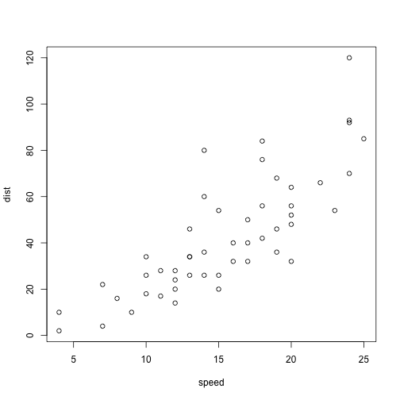

Presentation
========================================================
author: Yumi Komai and Pol Santaló
date: 02-12-2016
autosize: true

Introduction
========================================================
The aim of our research is to analyse if there is a significant impact on students ability made by the following factors: GDP per capita, Government expenditure, Population, Population density, Primary school pupil-teacher ratio, Mandatory schoolarisation years, Internet users and Mobile subscriptions.

**Hypothesis**

The hypothesis of our research is that Internet accessibility has a more substantial impact on the students ability than the others.


Methodology
========================================================
The aim of our research is to analyse if there is a significant impact on students ability made by the following factors: GDP per capita, Government expenditure, Population, Population density, Primary school pupil-teacher ratio, Mandatory schoolarisation years, Internet users and Mobile subscriptions.


Slide With Code
========================================================


```r
summary(cars)
```

```
     speed           dist       
 Min.   : 4.0   Min.   :  2.00  
 1st Qu.:12.0   1st Qu.: 26.00  
 Median :15.0   Median : 36.00  
 Mean   :15.4   Mean   : 42.98  
 3rd Qu.:19.0   3rd Qu.: 56.00  
 Max.   :25.0   Max.   :120.00  
```

Slide With Plot
========================================================


