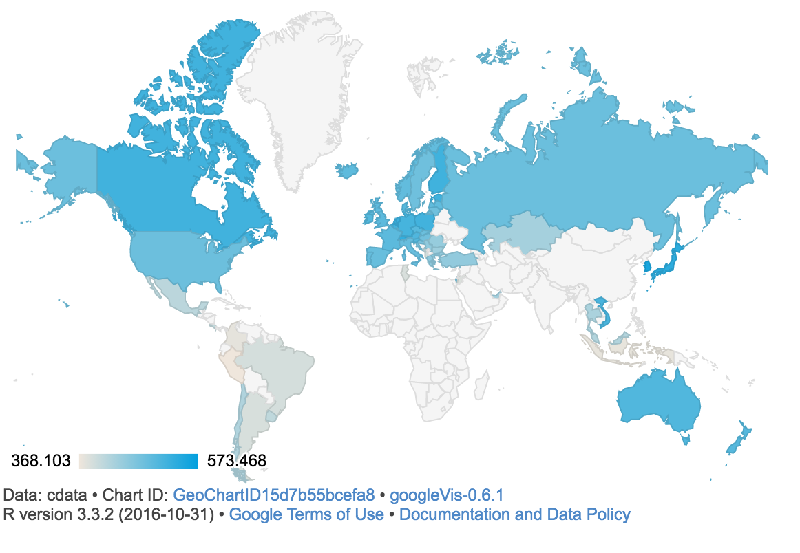

```{r setup, include=FALSE}
knitr::opts_chunk$set(echo = TRUE)
library(stargazer)
library(magrittr)  
library(ggplot2)
library(interplot)  
library(dplyr)  
library(devtools)
library(xlsx)
library(knitr)
library(DAAG)
library(googleVis)
library(jsonlite)
```

#Introduction
Currently, there is an on-going academic debate about the impact of Internet accessibility on the student’s academic ability. The points of view taking part in this debate are very diverse and mostly divergent. On the one hand, there are academics that argue that the Internet accessibility has a negative impact on the student’s academic ability, they think, for instance, that the management of social networks such as Facebook, Instagram or Twitter by youngsters, does not improve the student’s abilities, on the contrary, they consume their time and makes it difficult for them to assimilate new knowledge.

However, on the other side of the coin, there are other academics that believe exactly the contrary; that the Internet accessibility improves the student’s ability. They argue that easing the Internet accessibility to students eases the procedure to access information, which, at the same time, eases the learning and the knowledge absorption. 

Since both academics sides do not seem to be willing to pave the way for an agreement on this issue, because the positions are completely divergent, this paper will try to give an answer to this academic argue analysing the impact of the Internet accessibility on the student’s academic ability.

#Research Question and Hypothesis
The research question of this paper is whether the Internet accessibility creates a significant impact on the student’s ability or not, in order to give an answer to the debate that is currently on-going at the academic level, as mentioned in the introduction.

The hypothesis of this paper is that we consider that there is a significant impact, either positive or negative, of the Internet accessibility on the student’s ability because the academic research made until today, though divergent, points out that one of both academic points of view shall have a significant impact, thus we think that this significant impact could exist.

The research question does not try to give an absolute answer, but attempts to analyse and prove if there is a general tendency in a positive or negative direction, being aware that the huge amount of variables that can affect the student’s academic ability are not contemplated. 

However, it attempts to give an answer having into account the variables used, thus the verisimilitude of the findings are strictly linked to the extend of the variables that have been had into account when doing the research.

#Data
In this research, the data gathering has been obtained from two different data sources in order to address the researching question and prove if the initial hypothesis is right or not. 

##Data Sorces
The two different data sources used in this research are the follow:

1.World Data Bank
The World Data Bank is an analysis and visualisation tool that contains collections of time series data on a variety of topics. In this data sources plenty of data about a wide range of topics can be found, from GDP growth to CO2 emissions. 
The World Data Bank is part of The World Bank, which is an international financial institution that provides loans to developing countries for capital programs. It comprises two institutions: the International Bank for Reconstruction and Development (IBRD), and the International Development Association (IDA). The World Bank is a component of the World Bank Group, which is part of the United Nations system.

2.OECD (PISA)
The second data source used in the research is the Programme for the International Students Assessment (PISA). PISA is a worldwide study by the Organisation for Economic Co-operation and Development (OECD) in member and non-member nations of 15-year-old school pupils' scholastic performance on mathematics, science, and reading. It was first performed in 2000 and then repeated every three years. It is done with a view to improving education policies and outcomes. It measures problem solving and cognition in daily life.
Most of the countries that appear in PISA are European, American or Asian. That means that the data used in this research does not contemplate African countries, therefore the analyses and the results of this research will only apply to countries of these continents. 

Both datasets are completely open and they can be found in their respective web pages. In order to produce a tangible statistical analysis the relevant data for this research has been cleaned and merged from their web pages and, subsequently, tables and figures have been generated with the main aim of addressing, as well as possible, the research question to begin to determine whether our hypothesis is correct or not.
The tables and figures generated are established in a specific section of this research. In this section, they are explained in a concise manner and more widely.

##Cleaned and Merged 
We have cleaned and merged the relevant data of both datasets. Then, we have generate tables and figures to relate the data with the aim of addressing, as well as possible, our researching question to begin to determine whether our hypothesis is correct or not.

#Methodology
In order to analyze how influential is the Internet accessibility over the student’s ability, tThis research uses a multiple regression. In the first place, in order to analyze how influential is the Internet accessibility over the student’s ability, In the first place, tthe dependent variables (DV) are the ones obtained from the PISA data source. These are three different variables.

|Dependent Variable|Variable Name|Description|
|:--------|:------------------|:-----------------------------|
|DV|math|Mathmatics mean score(2012)|
|DV|reading|Readind mean score(2012)|
|DV|ps|Prolem Solving mean score(2012)|

a) Math score: This variable shows the score in mathematics of the students of the countries that took part in the Programme for International Student Assessment. 
The data collected is from the year 2012.

b) Reading score: This variable shows the score of reading comprehension of the students of the countries that took part in the Programme for International Student Assessment.  
The data collected is from the year 2012.

c) Problem solving:  This variable shows the score of the problem-solving exam of the students of the countries that took part in the Programme for International Student Assessment.

Math score and reading score are used for majoring student’s academic ability and the assessment for both ability have been conducted everytime. On the contrary, problem solving assessment is introduced in 2003 at the first time. According to PISA, it “measures students’ capacity to respond to non-routine situations in order to achieve their potential as constructive and reflective citizens. “

2. The World Bank:
On the other hand, Ithe research also contemplates independent variables (IV)s; those have been obtained from the World Data Bank and are the follows (the data collected is from the year 2012):

|Indivendent Variable|Variable Name|Description|
|:--------|:---------------|:-------------------------------------------------|
|IV|GDPperc|GDP per Capita (current US$)|
|IV|pop|Population, total|
|IV|popd| Population density (people per sq. km of land area)
|IV|rteacher|Primary school pupil-teacher ratio is the average number of pupils per teacher in primary school|
|IV|eyear|Number of years that children are legally obliged to attend school|
|IV|internet|internet users (per 100 people). Internet users are individuals who have used the Internet (from any location) in the last 12 months. Internet can be used via a computer, mobile phone, personal digital assistant, games machine, digital TV etc.|
|IV|mobile|Mobile cellular subscriptions (per 100 people)|

a)	GDP per capita: This variable shows the total value of all the goods and services produced by a country in a particular year, divided by the number of people living there. 

b)	Population: This variable shows the total number of persons inhabiting a country. 
	
c)	Population density: This variable shows a measurement of population per unit area or unit volume; it is a quantity of type number density.

d)	Primary School pupil teacher ratio: This variable shows the average of teachers per school that you can find in a certain country. 

e)	Compulsory education years in primary school: This variable shows the number of compulsory years of primary school in a certain country. 

f)	Internet Users: This variable shows the percentage of the population that uses Internet in a regular base. 

g) Mobile cellular subscriptions: This variable shows the percentage of the population that has a subscription with a mobile phone company and, therefore, use a phone in a regular base. 

The variables from a) to c) are used to fix the country size and economic power. The variables d) and e) are used to fix the quality of education, and finally the variables f) and g) are used as majors of Internet accessibility.

```{r , echo=FALSE, comment=NA, warning=FALSE, error=FALSE, message=FALSE, results='asis'}

#For Regression
##Data install
data <- read.xlsx("/Users/komaiyumi/Desktop/Social Sicence/web/Data/PISA_Data.xlsx",1)

##Data Cleaning
cdata <- subset(data, select = c(1,3,4,5,6,7,9,10,12,14,16))
cdata <- cdata[,c(1,3,2,4,7,8,9,10,11,5,6)]

#For Growth comparison
##Data install
pisa <- read.xlsx("/Users/komaiyumi/Desktop/Social Sicence/web/Data/PISA_Data.xlsx",2)
pisa <- pisa[1:41,]
```

#Multiple Regression
##Summary of statistics of the variable
The following table is a summary statistics of the variables. As is shown in the table, it should be took into account that the number of sample sizes are not enough, at most is 63 and at least is 42. Also, we took the logarithm of GDP per capita and population density.
```{r , echo=FALSE, comment=NA, warning=FALSE, error=FALSE, message=FALSE, results='asis'}

##Statistical Discriptions
stargazer(cdata, type="latex",header = FALSE,
          title= 'Summary statistics of the variables',
          font.size='tiny')
```

##Countries Surveyed Map
The following map shows the all surveyed countries colored by the number of internet users. As you can see, most countries are developed countries. Tunisia is the only country from the Africa continent. Middle East is also not covered other than Turkey, Qatar, Jordan, Israel and UAE. Therefore, we need to take it account this data deviation.

```{r , echo=FALSE, comment=NA, warning=FALSE, error=FALSE, message=FALSE, results='asis'}
##Countries Surveyed Map
GCi <- gvisGeoChart(cdata, locationvar = "country", colorvar = "internet")
plot(GCi)
```


##The result of Multiple Regression
The following table is the result of the multiple regressions.  There are two regression results for each score.

```{r , echo=FALSE, comment=NA, warning=FALSE, error=FALSE, message=FALSE, results='asis'}
##Conducting Regression
###Create labels
mlabels <- c('log(GDPperc)', 'log(pop)','popd', 'rteacher', 'eyear', 'internet','mobile','(intercept)')

###Math
ma.lm <- lm(math ~ log(GDPperc) + log(pop) +  popd + rteacher + eyear, data = cdata )
ma.lm2<- lm(math ~ log(GDPperc) + log(pop) +  popd + rteacher + eyear + internet + mobile,data = cdata )

###Create table
stargazer(ma.lm,ma.lm2,
          type='latex',header = F, 
          covariate.labels = mlabels,
          dep.var.labels = 'Math Score',
          title="Table:Regression Estimates of Math Score",
          no.space = TRUE)


###Reading
re.lm <- lm(reading ~ log(GDPperc) + log(pop) +  popd + rteacher + eyear, data = cdata )
re.lm2 <- lm(reading ~ log(GDPperc) + log(pop) +  popd + rteacher + eyear + internet + mobile,data = cdata )

stargazer(re.lm,re.lm2,type='latex',
          header = FALSE, no.space = TRUE,
          covariate.labels = mlabels,
          dep.var.labels = 'Reading Score',
          title="Table:Regression Estimates of Reading Score")

###Problem Solving
ps.lm <- lm(ps ~ log(GDPperc) + log(pop) +  popd + rteacher + eyear, data = cdata )
ps.lm2 <- lm(ps ~ log(GDPperc) + log(pop) +  popd + rteacher + eyear + internet + mobile, data = cdata )

##Comparison
stargazer(ma.lm,ma.lm2,re.lm,re.lm2,ps.lm,ps.lm2,
          type='latex', out='comparison 2 result.html',
          header = FALSE, no.space =TRUE,
          covariate.labels = mlabels,
          title="Table:Detarminants of Student's Ability",
          font.size='tiny')


```

###The result of the first regressions
Firstly, the variable internet and mobile are excluded from IV.  The result is (1), (3), and (5). In all results, GDP per capita has a strong positive correlation with three scores. If GDP per capita increase by 1%, the scores would increase around 20 to 26 points when other conditions being equal.  In addition, rteacher is negatively correlated to math and reading score. An additional increase of pupil-teacher ratio by 1% is associated with decreases of the math and reading score by around 3.5 point when other conditions being equal.

Therefore, it could be concluded that if GDP per capita increase or pupil-teacher ratio decrease, the math and reading score would increase when other conditions being equal. On the other hand, the problem solving score would increase only when GDP per capita increase. 

###The result of the second regressions
1.Math and Reading Score
Then, internet and mobile were included as IV, and the results are shown in (2), (4) and (6). First of all, the math and reading results are very similar.

Internet has a positive correlation and they are significant at 1% level. If the number of internet users (per100) increase by 1, the math score would increase by 2.570 and the reading score would increase by 2.154 when other things being equal.

Interestingly, now GDP per capita has strong negative correlations, although it is not statistically significant for the reading score. If GDP per capita increase by 1%, the math score would decrease by 20 point when other things being equal.

In addition, population, population density, pupil- teacher ratio are also statistically significant.

2. Problem Solving Score
As regards to the problem solving score, a different result is shown. Internet still has a positive correlation, but the coefficient of internet is smaller than the other two scores(1.938). In addition, for the problem solving, internet is statistically significant at 5% level, even though it is at 1% level for the reading and math scores. 
In addition, other variables are not likely to have a correlation with the score. The adjusted R-squared is the lowest among the three regressions. Therefore, there is a high possibility that other factors are highly related to the problem solving score other than country size and educational quality.

##Diagnose 
In order to confirm the reliability of the result, this section examines some kinds of diagnoses.

###Variance Inflation Factors table
There may be high correlation between the number of internet users, GDP per capita and educational quality. 

```{r , echo=FALSE, comment=NA, warning=FALSE, error=FALSE, message=FALSE, results='asis'}

##VIF
v1 <- c('math',vif(ma.lm2))
v2 <- c('reading',vif(re.lm2))
v3 <- c('problem solving',vif(ps.lm2))

stargazer(v1,v2,v3,type='latex', header = FALSE, 
          no.space =TRUE, 
          font.size = 'tiny',out='vif.html')


```
This is a Variance Inflation Factors table.  This table shows that GDPperc, popd and internet have relatively high VIF, but all values are less than 5.5. Thus, we could conclude there is not serious multicollinearity problem

###Plots for diagnose
```{r , echo=FALSE, comment=NA, warning=FALSE, error=FALSE, message=FALSE, results='asis'}
plot(ma.lm2)
plot(re.lm2)
plot(ps.lm2)
```

1.Residual vs Fitted
 The three plots show that there is not serious heteroscedasticity.
2.Normal Q-Q
Most of dots of each plot are on the line, so the residuals of three regressions are likely to follow normal distribution.
3.Scale-Location
There seems to exist some expanding of each residual. Therefore, other variables may be related to residuals. Actually, R-squired is not so high in our regression, it may necessary to add other variables.
4.Residual vs Leverage
All data are within the 0.5 line, therefore, there would be no data that affect strongly on the results.

##Analysis of Problem Solving
As mentioned at the beginning, it is controversial whether Internet accessibility always bring positive effect on student’s abilities. Some research examines that student’s critical thinking ability, which is not related to academic ability, might be harmed because of too much information from twitter, Facebook and other SNSs.

Actually, the result of the regression shows the different result about the problem solving from the math and the reading. Therefore, this section examines more about the interpretation of the correlation between the problem solving and internet accessibility.

###Seeing the result by givesGeoChart
Firstly, we compared the result by using the GeoChart. There is three GeoCharts: the blue one is math, the purple one is reading and the orange one is problem solving (green countries don’t have the problem solving test score.)

```{r , echo=FALSE, comment=NA, warning=FALSE, error=FALSE, message=FALSE, results='asis'}
GCm <- gvisGeoChart(cdata, locationvar = "country", colorvar = "math", options=list(colors='#019FDE'))
plot(GCm)

GCr <- gvisGeoChart(cdata, locationvar = "country", colorvar = "reading", options=list(colors='#9601D5'))
plot(GCr)

GCps <- gvisGeoChart(cdata, locationvar = "country", colorvar = "ps", options=list(colors='#D05E01'))
plot(GCps)

```



As is shown in the result, developed countries got relatively high score of all kinds of tests. However, the countries of which math and reading score is low (and Internet accessibility is low), they are likely not to cooperate the problem solving assessment. For example, only Malaysia had a result of problem solving in the Southeast Asia. In addition, two countries are removed in the South America, and several countries are also removed from Middle East. Thus, we need to be careful that more developing countries are removed from the result when we analyze the problem solving score.

###The number of internet users and the problem solving score
```{r , echo=FALSE, comment=NA, warning=FALSE, error=FALSE, message=FALSE, results='asis'}

### adding the label based on GDP per capita
summary(data$GDPperc)
glabel <- cut(cdata$GDPperc, breaks=c(1754,10690,20580,31350,45720,149200),
    labels=c("low","middle-low","middle","middle-high","high"),
    right=FALSE,include_lowest=TRUE)
lcdata <- transform(cdata,GDPperc_label=glabel)

###correlation between internet and ps score
pplot <- ggplot(lcdata,aes(x=ps,y=internet))+
  geom_point(aes(colour=GDPperc_label))+
    stat_smooth(method="lm")

```

This plot show the correlation between the number of internet users and the problem solving score.  All countries are divided into five groups based on the quartiles of GDP per capita as follows:

|Group|Range of GDP per capita|
|:--------|:------------------|
|low|~10,690|
|middle-low|10691~20,580|
|middle|20,581~31350|
|middle-high|31351~45720|
|high|45721~|

The blue line is the single regression line, and the ribbon is 95% confidential area. The plot shows that the problem solving score and the number of internet users are positively correlated. The purple dots (high) are shown on the upper-right side and the red dots(low) are shown on the under-left side. It shows quite natural result that the higher GDP per capita becomes, the more people use internet and the higher the score becomes. 
	
###Score Growth and Internet Users
Next, we focused on the score growth. PISA conducted the similar problem solving test in 2003. The following plot examines the correlation between the score growth of each country from 2003 to 2012 and the number of internet users in 2012.

```{r , echo=FALSE, comment=NA, warning=FALSE, error=FALSE, message=FALSE, results='asis'}
##Plot and Correlation
###score growth and the number of internet users
##Labeling
g2label <- cut(pisa$GDPperc, breaks=c(1754,10690,20580,31350,45720,149200),
    labels=c("low","middle-low","middle","middle-high","high"),
    right=FALSE,include_lowest=TRUE)
lpisa <- transform(pisa,GDPperc_label=g2label)

p <- ggplot(lpisa, aes(INTERNET.USERS.2012..per.100.people.,Score.growth))+
  geom_point(aes(colour = GDPperc_label))+
  stat_smooth(method="lm")+
  theme_bw()
plot(p)
```

Now they have a negative correlation. It means that the more people use internet, the less point of score grow. However, considering the GDP per capita, red dots (low) are on the upper-left side and purple dots (high) are middle-right side. Furthermore, purple dots are likely to be close to zero. 

Therefore, it could be possible to say that purple dot countries’ test score didn’t have a potential to increase so much in 9 years because their education system was already mature in 2003.  In contrast, red dot countries could have more potential to improve the score. Thus, it might be misleading to conclude that if the number of internet user increase, the score growth decrease.

###Score Growth and Internet Users Growth
Lastly, this plots examines the correlation between the score growth and the number of internet user growth. 

```{r , echo=FALSE, comment=NA, warning=FALSE, error=FALSE, message=FALSE, results='asis'}
###Growth of the score and the number of internet users growth
p2 <- ggplot(lpisa, aes(Internet.users.growth, Score.growth))+
  geom_point(aes(colour = GDPperc_label))
plot(p2)
```
However, the plots don’t show any correlation between two variables. It might be inferred that the number of internet user growth has few impact on the sore growth with high GDP per capita because the purple dots are relatively close to zero.


#Findings, Limitations and Next Step
##Findings
The following three points are the major findings through the research:
-	Internet accessibility could have a strong impact on student’s ability.
-	However, the impact could be weaker on the problem solving ability than academic ability
-	The impact of internet accessibility on student’s ability would be different depends on the country’s GDP per capita.

##Limitaions
However, there are some limitations in this research.

-	Small sample size
PISA conducted the assessment for 34 OECD countries and 31 partnership countries, and the less number of countries cooperated with the problem solving assessment. Therefore, the sample size was not enough to run the effective multiple regressions.

-	Available data limitation
PISA did the assessment mainly for OECD countries, so the picked-up countries are originally biased (developed countries from Europe, North and South America and Asia). If more developing countries are added to the data, the result could be different., 

-	Finding Proper Variables
As is mentioned in the Diagnose part, other variable would have a influence on the test scores. 

##To moving forward
As a next step, it would be necessary to focus on two or three countries from different level of GDP per capita and analyze the correlation of test score and internet accessibility. It is because this research shows the impact of internet accessibility would be different depending on the country’s GDP per capita. Also, we couldn’t get enough score data from developing countries, so our research has data bias.

In addition, by focusing on transitions of test scores in a few countries, we could use panel data. We simply used the cross sectional data in this research because of the data availability, but research result will be more meaningful if we use panel data by analyzing the transition of score growth and Internet accessibility. 

Also, we didn’t include student’s specific factors that may have influence on student’s ability, because we did the comparison between countries. If we analyze focusing on the transition of the scores in a country, we could include the specific factors such as parent’s income, parent’s education level and so on. It would make this research more meaningful.


